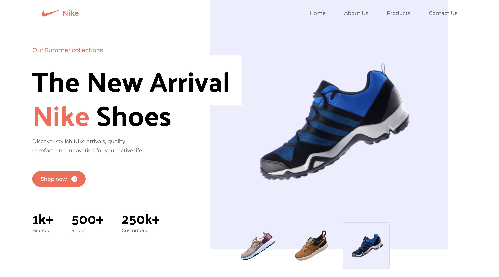

# Nike Landing Page - Tailwind CSS


This is a sample landing page for Nike created using Tailwind CSS, a highly customizable CSS framework that makes building responsive and sleek web interfaces a breeze. This project showcases how Tailwind CSS can be used to create a modern and visually appealing landing page for a brand like Nike.

## Table of Contents

- [Demo](#demo)
- [Features](#features)
- [Installation](#installation)
- [Usage](#usage)
- [Customization](#customization)
- [Contributing](#contributing)
- [Credits](#credits)

## Demo

Check out the live demo of the Nike Landing Page [here](https://tailwind-nike-gray.vercel.app/).

## Features

- Responsive design: The landing page looks great on various screen sizes and devices.
- Hero section: A stunning hero section with a background image, title, and call-to-action button.
- Product showcase: Display of featured Nike products with attractive images and details.
- Stylish footer: Footer section with social media links, contact information, and a subscription form.

## Installation

1. Clone this repository to your local machine:

   ```bash
   git clone https://github.com/D-Ankita/Tailwind_Nike.git
   ```
2. Navigate to the project directory:

    ```bash
    cd Tailwind_Nike
    ```
   
3. Install the required dependencies:
    ```bash
    npm install

    ```

## Usage

After the installation, you can start the development server:
    ```bash
    npm run dev
    ```

This will launch the landing page in your default web browser. You can also access it at `http://localhost:5173/`.

## Customization

The landing page is built using Tailwind CSS, which makes customization straightforward. You can modify the styles, content, images, and layout to match your needs.

- **Styles**: Customize the colors, fonts, spacing, and other styles by editing the `tailwind.config.js` file.
- **Content**: Update the HTML content in the corresponding files within the `src` directory.
- **Images**: Replace the images in the `src/assets` directory with your own images.
- **Layout**: Adjust the layout and structure by modifying the HTML files in the `src` directory.

## Contributing

Contributions are welcome! If you find any issues or want to enhance the landing page, feel free to open a pull request. Make sure to follow the existing code style and guidelines.

## Credits

Nike landing page created using Tailwind CSS, inspired by the Tailwind CSS Full Course 2023 | Build and Deploy a Nike Website by JS Mastery YouTube channel.

---


